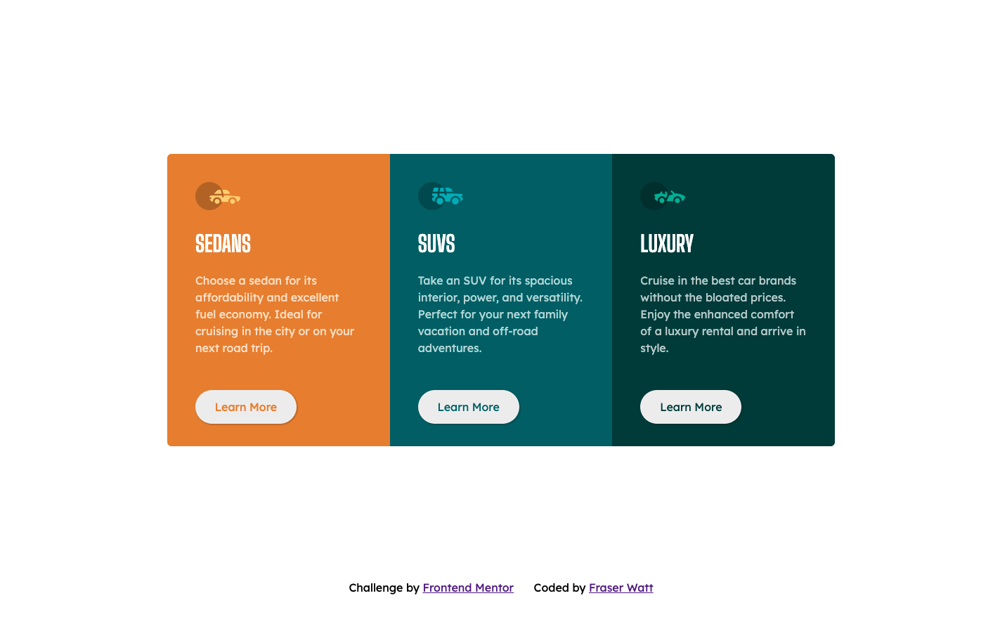

# Frontend Mentor - 3-column preview card component solution

This is a solution to the [3-column preview card component challenge on Frontend Mentor](https://www.frontendmentor.io/challenges/3column-preview-card-component-pH92eAR2-). Frontend Mentor challenges help you improve your coding skills by building realistic projects.

## Table of contents

- [Overview](#overview)
  - [The challenge](#the-challenge)
  - [Screenshot](#screenshot)
  - [Links](#links)
- [My process](#my-process)
  - [Built with](#built-with)
  - [What I learned](#what-i-learned)
  - [Continued development](#continued-development)
- [Author](#author)

**Note: Delete this note and update the table of contents based on what sections you keep.**

## Overview

### The challenge

Users should be able to:

- View the optimal layout depending on their device's screen size
- See hover states for interactive elements

### Screenshot

### Links

- Solution URL: [Add solution URL here](https://your-solution-url.com)
- Live Site URL: [Add live site URL here](https://projects-frontend-mentor.vercel.app/)

## My process

### Built with

- HTML5
- SCSS
- Javascript
- Flexbox
- Mobile-first workflow

### What I learned

Really getting the hang of Flexbox now, the first project where I didn't (although it's only a small thing) spend ages trying to get the container and footer positioned correctly.

### Continued development

Need to get those transitions smoother.

## Author

- Frontend Mentor - [@yourusername](https://www.frontendmentor.io/profile/fraserwat)
- Twitter - [@fsrtweet](https://www.twitter.com/fsrtweet)
