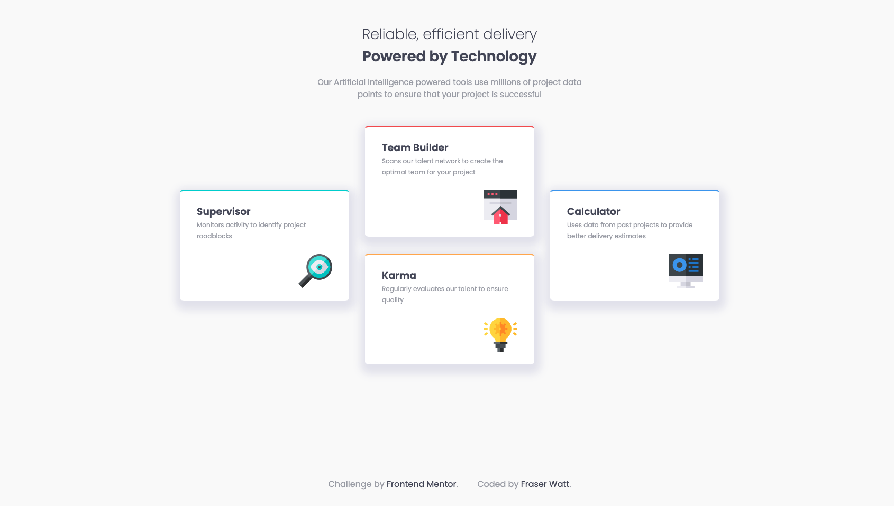

# Frontend Mentor - Four card feature section solution

This is a solution to the [Four card feature section challenge on Frontend Mentor](https://www.frontendmentor.io/challenges/four-card-feature-section-weK1eFYK). Frontend Mentor challenges help you improve your coding skills by building realistic projects.

## Table of contents

- [Overview](#overview)
  - [The challenge](#the-challenge)
  - [Screenshot](#screenshot)
  - [Links](#links)
- [My process](#my-process)
  - [Built with](#built-with)
  - [What I learned](#what-i-learned)
  - [Continued development](#continued-development)
  - [Useful resources](#useful-resources)
- [Author](#author)

## Overview

### The challenge

Users should be able to:

- View the optimal layout for the site depending on their device's screen size

### Screenshot

### Links

- [Frontend Mentor Solution](https://www.frontendmentor.io/solutions/four-card-feature-section-using-scss-grid-VEcmJ0eCK)
- [Live Site](https://four-card-feature-selection-fraserwat.vercel.app/)

## My process

### Built with

- Semantic HTML5 markup
- CSS custom properties
- CSS Grid

### What I learned

This was the first time I'd used CSS Grid (and I think it shows!). Must be a better way to go about it than all the media queries I wrote. Hoping to get some guidence on that.

### Continued development

The next project I pick will be quite a CSS Grid heavy one I think, this is definitely an area I need to improve in.

Aside from that this was just a good way to practice on the fundamentals and build on the last challenge.

### Useful resources

- [CSS-Tricks.com article on CSS Grid](https://css-tricks.com/look-ma-no-media-queries-responsive-layouts-using-css-grid/) - Despite the title of the article, I did end up using media queries (a lot of them!). Probably not the best way of going about it!

## Author

- Frontend Mentor - [@fraserwat](https://www.frontendmentor.io/profile/fraserwat)
- Twitter - [@fsrtweet](https://www.twitter.com/fsrtweet)
