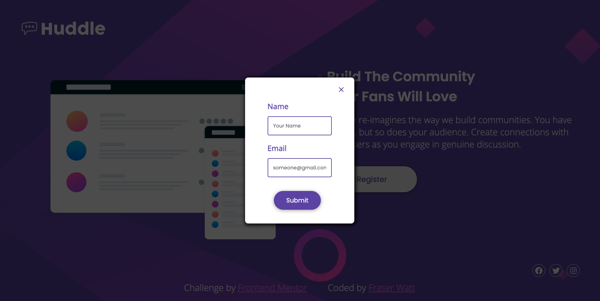

# Frontend Mentor - Huddle landing page with single introductory section solution

This is a solution to the [Huddle landing page with single introductory section challenge on Frontend Mentor](https://www.frontendmentor.io/challenges/huddle-landing-page-with-a-single-introductory-section-B_2Wvxgi0). Frontend Mentor challenges help you improve your coding skills by building realistic projects.

## Table of contents

- [Overview](#overview)
  - [The challenge](#the-challenge)
  - [Screenshot](#screenshot)
  - [Links](#links)
- [My process](#my-process)
  - [Built with](#built-with)
  - [What I learned](#what-i-learned)
  - [Continued development](#continued-development)
  - [Useful resources](#useful-resources)
- [Author](#author)

**Note: Delete this note and update the table of contents based on what sections you keep.**

## Overview

### The challenge

Users should be able to:

- View the optimal layout for the page depending on their device's screen size
- See hover states for all interactive elements on the page

### Screenshot

Add a screenshot of your solution. The easiest way to do this is to use Firefox to view your project, right-click the page and select "Take a Screenshot". You can choose either a full-height screenshot or a cropped one based on how long the page is. If it's very long, it might be best to crop it.

Alternatively, you can use a tool like [FireShot](https://getfireshot.com/) to take the screenshot. FireShot has a free option, so you don't need to purchase it.

Then crop/optimize/edit your image however you like, add it to your project, and update the file path in the image above.

**Note: Delete this note and the paragraphs above when you add your screenshot. If you prefer not to add a screenshot, feel free to remove this entire section.**

### Links

- [Solution URL](https://www.frontendmentor.io/solutions/landing-page-with-pure-css-popup-form-rketnWKVl)
- [Live Site URL](https://huddle-landing-page-mu-nine.vercel.app/)

## My process

### Built with

- HTML5 / SCSS
- CSS pseudo-classes
- CSS Grid
- Mobile-first workflow
- [Font Awesome](https://fontawesome.com/how-to-use/on-the-web/using-with/sass) - For icons

### What I learned

Had some real trouble getting things to scale properly as things started to get wider, but basically got there in the end, so this was good at just revising the fundamentals.

Extended this challenge by adding a registration popup to the "Register" button. This was good practice for adding interactivity, although I wanted to do this in Pure CSS, no JavaScript. Maybe not best practice but there you go.

### Continued development

There were a couple of things I wasn't really happy with with how this turned out:

- As it started to get wider (but not wide enough for the grid to fill out that wide) you ended up with a lot of blank space. I'm not sure how much of this is inherent to the design and how much of it was shoddy formatting on my part. Want to get better at implementing wide designs, which seems pretty vague but I think can dictate what challenge I take next.
- The hover over the `x` to close the popup is on the whole width of that element, not just the cross. Likewise the whole element is a link to close it. That's annoying, want to work out how to fix this.
- The popup form should be a bit wider at higher widths but that kept messing up the formatting.

### Useful resources

- [Pure CSS Popup](https://codepen.io/imprakash/pen/GgNMXO) - This helped me work out how you'd do a popup in pure CSS.

## Author

- Frontend Mentor - [@fraserwat](https://www.frontendmentor.io/profile/fraserwat)
- Twitter - [@fsrtweet](https://www.twitter.com/fsrtweet)
