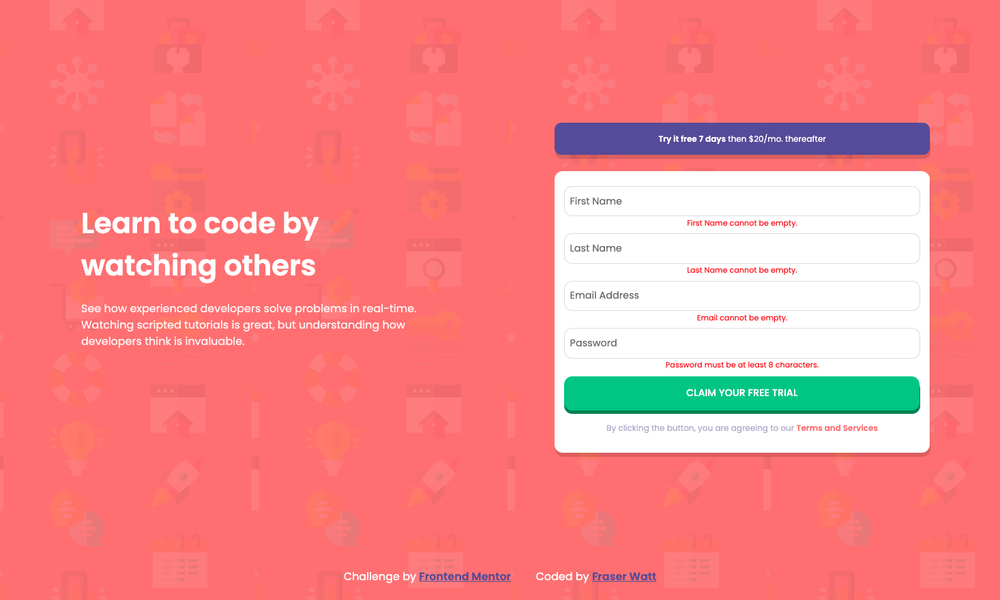

# Frontend Mentor - Intro component with sign up form solution

This is a solution to the [Intro component with sign up form challenge on Frontend Mentor](https://www.frontendmentor.io/challenges/intro-component-with-signup-form-5cf91bd49edda32581d28fd1). Frontend Mentor challenges help you improve your coding skills by building realistic projects.

## Table of contents

- [Overview](#overview)
  - [The challenge](#the-challenge)
  - [Screenshot](#screenshot)
  - [Links](#links)
- [My process](#my-process)
  - [Built with](#built-with)
  - [What I learned](#what-i-learned)
  - [Continued development](#continued-development)
  - [Useful resources](#useful-resources)
- [Author](#author)

**Note: Delete this note and update the table of contents based on what sections you keep.**

## Overview

### The challenge

Users should be able to:

- View the optimal layout for the site depending on their device's screen size
- See hover states for all interactive elements on the page
- Receive an error message when the `form` is submitted if:
  - Any `input` field is empty. The message for this error should say _"[Field Name] cannot be empty"_
  - The email address is not formatted correctly (i.e. a correct email address should have this structure: `name@host.tld`). The message for this error should say _"Looks like this is not an email"_

### Screenshot



### Links

- Solution URL: [Add solution URL here](https://www.frontendmentor.io/solutions/form-validation-with-3d-button-ms-hqV01T)
- Live Site URL: [Add live site URL here](https://intro-signup-form-mu.vercel.app/)

## My process

### Built with

- HTML5
- SASS
- Flexbox
- CSS Grid
- Mobile-first workflow

### What I learned

Was a bit more advanced form validation this one, as there were multiple different things I was evaluating for (regex for email, empty strings for first/last name, I wanted passwords to be at least 8 characters), was pleased with my method of doing this (functions for adding/removing error class, and running each input through a switch statement).

```js
inputs.forEach(input => {
  switch (input.type) {
    case 'password':
      (input.value.length < 8) ? addErrorClass(input.classList[0]) : removeErrorClass(input.classList[0]);
      break;
    case 'email':
      (!(emailRegex.test(input.value))) ? addErrorClass(input.classList[0]) : removeErrorClass(input.classList[0]);
      break;
    default:
      (input.value.length < 1) ? addErrorClass(input.classList[0]) : removeErrorClass(input.classList[0]);
    }
  })
}
```

### Continued development

Reckon next project should be to look at using JavaScript for something that isn't form validation.

### Useful resources

- [Building a 3D Button - Josh Comeau](https://www.joshwcomeau.com/animation/3d-button/) - This was a great article that helped me get a cool 3D button effect

## Author

- Frontend Mentor - [@fraserwat](https://www.frontendmentor.io/profile/fraserwat)
- Twitter - [@fsrtweet](https://www.twitter.com/fsrtweet)
