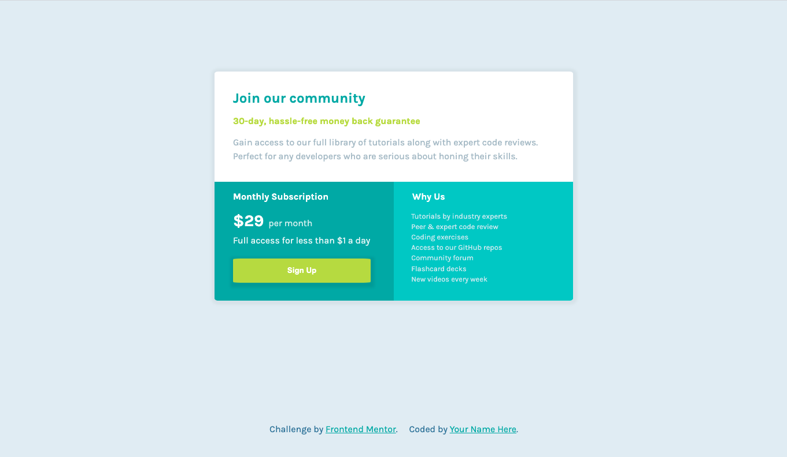

# Frontend Mentor - Single price grid component solution

This is a solution to the [Single price grid component challenge on Frontend Mentor](https://www.frontendmentor.io/challenges/single-price-grid-component-5ce41129d0ff452fec5abbbc). Frontend Mentor challenges help you improve your coding skills by building realistic projects.

## Table of contents

- [Overview](#overview)
  - [The challenge](#the-challenge)
  - [Screenshot](#screenshot)
  - [Links](#links)
- [My process](#my-process)
  - [Built with](#built-with)
  - [What I learned](#what-i-learned)
  - [Continued development](#continued-development)
- [Author](#author)

## Overview

### The challenge

Users should be able to:

- View the optimal layout for the site depending on their device's screen size

### Screenshot

### Links

- [Frontend Mentor Solution](https://www.frontendmentor.io/solutions/sass-based-css-grid-for-y-3DHkk7y)
- [Live Site](https://single-price-grid-component-theta-one.vercel.app/)

## My process

### Built with

- HTML
- SASS
- CSS Grid

### What I learned

Mainly just revising the fundamentals and cementing what I'd learnt about CSS Grid in the last challenge, but [this Kevin Powell video on ems and rems](https://www.youtube.com/watch?v=_-aDOAMmDHI) was useful in getting the different font sizes in different divs more uniform.

### Continued development

Surprisingly the CSS Grid part I didn't really find too challenging. The button styling is the bit that really got me. Asking for feedback on how to fix this, which I guess will dictate what I need to work on next..

I think there's probably more cool / advanced stuff I could do with box shadows and the button animation as well. Lets see.

## Author

- Frontend Mentor - [@fraserwat](https://www.frontendmentor.io/profile/fraserwat)
- Twitter - [@fsrtweet](https://www.twitter.com/fsrtweet)
