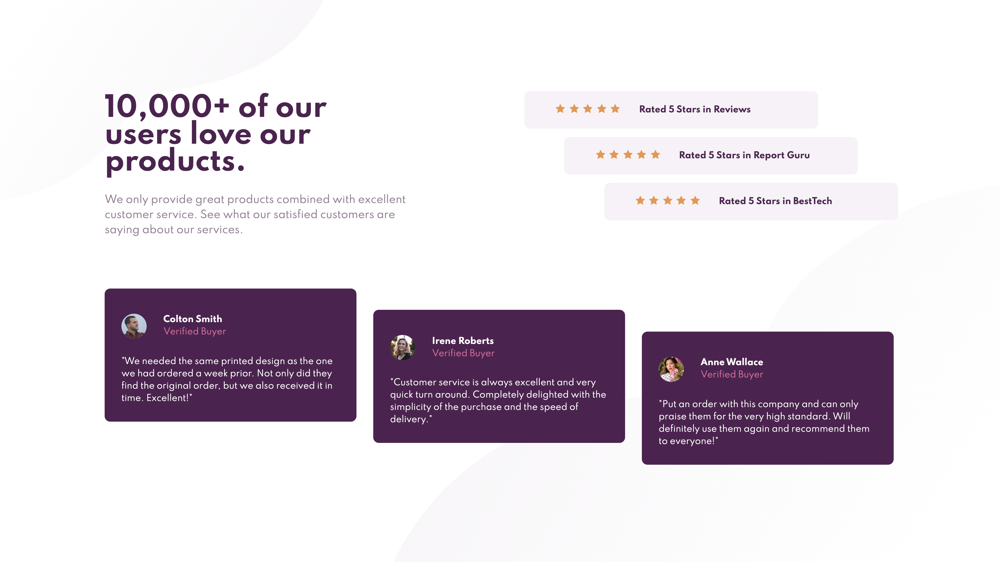

# Frontend Mentor - Social proof section solution

This is a solution to the [Social proof section challenge on Frontend Mentor](https://www.frontendmentor.io/challenges/social-proof-section-6e0qTv_bA). Frontend Mentor challenges help you improve your coding skills by building realistic projects.

## Table of contents

- [Overview](#overview)
  - [The challenge](#the-challenge)
  - [Screenshot](#screenshot)
  - [Links](#links)
- [My process](#my-process)
  - [Built with](#built-with)
  - [What I learned](#what-i-learned)
  - [Continued development](#continued-development)
- [Author](#author)

**Note: Delete this note and update the table of contents based on what sections you keep.**

## Overview

### The challenge

Users should be able to:

- View the optimal layout for the section depending on their device's screen size

### Screenshot

### Links

- Solution URL: [https://www.frontendmentor.io/challenges/social-proof-section-6e0qTv_bA/hub/social-proof-sass-grid-flexbox-pqHEqI42s](https://www.frontendmentor.io/challenges/social-proof-section-6e0qTv_bA/hub/social-proof-sass-grid-flexbox-pqHEqI42s)
- Live Site URL: [https://projects-frontend-mentor.vercel.app/](https://projects-frontend-mentor.vercel.app/)

### Built with

- HTML5
- CSS custom properties
- Flexbox
- CSS Grid
- Mobile-first workflow

### What I learned

I'd got into the habit of just putting everything in unordered lists, so this was a good one to break me out that habit. This works well, but I'm not sure how I'd do the staggering with more than three items... Maybe through JavaScript?

### Continued development

I'm still looking for a way to get the footer to "flex" itself to the bottom of the page. In the end I just got irritated with it and deleted it - something for the next challenge!

## Author

- Frontend Mentor - [@fraserwat](https://www.frontendmentor.io/profile/fraserwat)
- Twitter - [@fsrtweet](https://www.twitter.com/fsrtweet)
